<!-- ===================== HERO BANNER ===================== -->
<div align="center">


<br/>


<br/><br/>

<a href="mailto:kiruthikbairavan13@gmail.com"></a>
<a href="https://www.linkedin.com/in/kiruthikbairavan-c-3a35b626b" target="_blank"></a>
<a href="https://portfolio-kiruthik.vercel.app" target="_blank"></a>
<a href="https://github.com/kiruthik13?tab=followers"></a>

</div>

<br/>


<!-- ===================== QUOTE ===================== -->
<div align="center">

</div>

<!-- ===================== ABOUT ===================== -->
## 👋 About Me

<div align="center">

<table width="100%">
<tr>
<td>

```
● ● ●  kiruthik@dev ~
```

```yaml
whoami:          Kiruthik Bairavan C
role:            Aspiring Full-Stack Developer (Fresher)
education:       M.Sc. Software Systems @ Kongu Engineering College
core_stack:      [React, Node.js, Express, MongoDB, ASP.NET Core, Java]
certifications:  [Oracle Java SE 17, Oracle GenAI, NPTEL Cybersecurity]
achievements:    2× 1st Prize (CTPG PoC & Ideathon) · 2nd Prize (KEC Hackathon)
publication:     "IEEE AIMLA 2026 — Bitcoin Price Prediction, Deep Learning"
now_building:    CareSync — Hospital Appointment Booking Platform
philosophy:      "Ship fast. Design premium. Never ship generic UI."
```

</td>
</tr>
</table>

</div>


<!-- ===================== TECH STACK ===================== -->
## 🧠 Tech Arsenal

<div align="center">

<table>
<tr><th align="left">🎨 Frontend</th><td></td></tr>
<tr><th align="left">⚙️ Backend</th><td></td></tr>
<tr><th align="left">🗃️ Database & Cloud</th><td></td></tr>
<tr><th align="left">🛠️ Tools</th><td></td></tr>
</table>

</div>


<!-- ===================== FEATURED PROJECT ===================== -->
## 🚀 Flagship Project

<div align="center">

<table>
<tr><td>

<div align="center">

### 🏥 CareSync
#### Hospital Appointment Booking System

*Full-stack platform with role-based dashboards for patients, doctors & admins —
real-time analytics, automated email workflows, and PDF receipt generation.*


`Role-based Auth` `Nodemailer` `jsPDF Receipts` `Live Dashboards`

</div>

</td></tr>
</table>

</div>


<!-- ===================== PROJECTS GRID ===================== -->
## 💼 Project Portfolio

<table>
<tr>
<td width="50%" valign="top">
<h4>🔍 Smart Phishing URL Detector</h4>
Real-time phishing URL detection powered by the Claude API.
<br/><br/>
 
</td>
<td width="50%" valign="top">
<h4>📦 Inventory & Stock Management</h4>
Enterprise inventory system built on Clean Architecture principles.
<br/><br/>
 
</td>
</tr>
<tr>
<td width="50%" valign="top">
<h4>👨‍💻 Collaborative Code Review Tool</h4>
Real-time collaborative code review with live cursors & AI suggestions.
<br/><br/>
  
</td>
<td width="50%" valign="top">
<h4>💰 ExpenseTracker</h4>
Personal finance tracker with a premium fintech-style UI.
<br/><br/>
 
</td>
</tr>
<tr>
<td width="50%" valign="top">
<h4>🏗️ JustFence</h4>
Production-ready fencing business portal — quotes, approvals, invoicing.
<br/><br/>
 
</td>
<td width="50%" valign="top">
<h4>🛒 Organic Products E-Commerce</h4>
Mobile-first eco-friendly shopping app with Firebase Auth.
<br/><br/>
 
</td>
</tr>
</table>

<div align="center"><i>⭐ More on <a href="https://github.com/kiruthik13?tab=repositories">GitHub</a> · <a href="https://portfolio-kiruthik.vercel.app">Portfolio</a></i></div>


<!-- ===================== ACHIEVEMENTS ===================== -->
## 🎓 Certifications & Achievements

<div align="center">


<br/><br/>

| 🏆 | Achievement |
|:---:|:---|
| 🥇 | **1st Prize** — CTPG Proof of Concept 2025, Kongu Engineering College |
| 🥇 | **1st Prize** — CTPG Ideathon 2025, Kongu Engineering College |
| 🥈 | **2nd Prize** — KEC Hackathon 2025 |
| 📄 | **IEEE AIMLA 2026** — *Enhanced Bitcoin Price Direction Prediction Using Deep Learning and Cross-Cryptocurrency Market Signals* |

</div>


<!-- ===================== GITHUB STATS ===================== -->
## 📊 GitHub Analytics

<div align="center">




<br/>



</div>


<!-- ===================== ACTIVITY + SNAKE ===================== -->
<details open>
<summary><h2 style="display:inline">📈 Contribution Activity</h2></summary>

<div align="center">

</div>

</details>


<!-- ===================== FOOTER ===================== -->
<div align="center">

### 🤝 Let's build something amazing together

*Open to full-stack developer roles — MERN & .NET*


<br/><br/>


</div>
