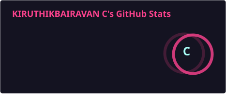
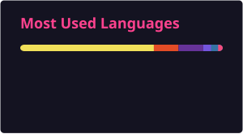

<!doctype html>
<html><head><meta charset="utf-8"><meta name="viewport" content="width=device-width,initial-scale=1">
<title>Kiruthik README Premium V2</title>
</head><body><main>

<b>🟢 OPEN TO WORK</b> &nbsp; · &nbsp; 📍 INDIA &nbsp; · &nbsp; 🎓 MSc SOFTWARE SYSTEMS

<h2>⚡ Quick Identity</h2>
<table><tr><td class="center"><b>BUILD</b> Scalable Full-Stack Apps</td><td class="center"><b>DESIGN</b> Premium UI</td><td class="center"><b>THINK</b> Clean Architecture</td><td class="center"><b>SHIP</b> Production Ready</td></tr></table>
<h2>👋 About Me</h2>
<pre>whoami:          Kiruthik Bairavan C
role:            Aspiring Full-Stack Developer (Fresher)
education:       M.Sc. Software Systems @ Kongu Engineering College
core_stack:      React · Node.js · Express · MongoDB · ASP.NET Core · Java
now_building:    CareSync — Hospital Appointment Booking Platform
philosophy:      "Ship fast. Design premium. Never ship generic UI."</pre>
<h2>🧠 Tech Arsenal</h2>

  
  

<h2>🔥 What I'm Building Now</h2>
<table><tr><td><b>🏥 CareSync</b> Healthcare appointment platform.</td><td><b>⚙️ .NET Engineering</b> C# · .NET · PostgreSQL · RDLC · Telerik.</td><td><b>🤖 AI + Research</b> AI applications and deep learning.</td></tr></table>
<h2>🚀 Flagship Project</h2>

<h3>🏥 CareSync</h3>
Hospital Appointment Booking System with role-based dashboards, analytics, automated email workflows and PDF receipt generation.

<code>React</code> <code>Node.js</code> <code>MongoDB</code> <code>Recharts</code> <code>Nodemailer</code> <code>jsPDF</code>

<h2>💼 Project Portfolio</h2>
<table><tr><td><b>🔍 Smart Phishing URL Detector</b> React · Claude API</td><td><b>📦 Inventory & Stock Management</b> .NET 8 · MySQL</td></tr>
<tr><td><b>👨‍💻 Collaborative Code Review</b> Socket.io · Monaco · AI</td><td><b>💰 ExpenseTracker</b> MERN · Recharts</td></tr>
<tr><td><b>🏗️ JustFence</b> React · Firebase</td><td><b>🛒 Organic E-Commerce</b> Flutter · Firebase</td></tr></table>
<h2>🎓 Certifications & Achievements</h2>
<table><tr><td class="center">🥇 <b>CTPG PoC</b> 1st Prize</td><td class="center">🥇 <b>CTPG Ideathon</b> 1st Prize</td><td class="center">🥈 <b>KEC Hackathon</b> 2nd Prize</td><td class="center">📄 <b>IEEE AIMLA</b> Published</td></tr></table>
<h2>📊 GitHub Analytics</h2>
  

<h2>📈 Contribution Activity</h2>

<h2>🤝 Let's build something amazing together</h2>
<b>Open to full-stack developer roles — MERN & .NET</b>

</main></body></html>
